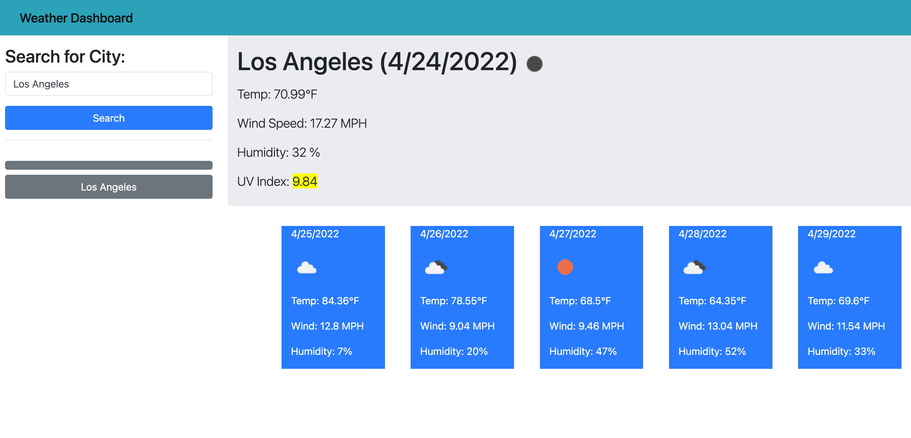

# WeatherDashboard
This is a weather API that gives vaarious information according to the city search. After your search, it will add on a history list. 

Live Website: https://chrisnunez.github.io/WeatherDashboard/

Repository: https://github.com/chrisnunez/WeatherDashboard
## User Story

```
AS A traveler
I WANT to see the weather outlook for multiple cities
SO THAT I can plan a trip accordingly
```

